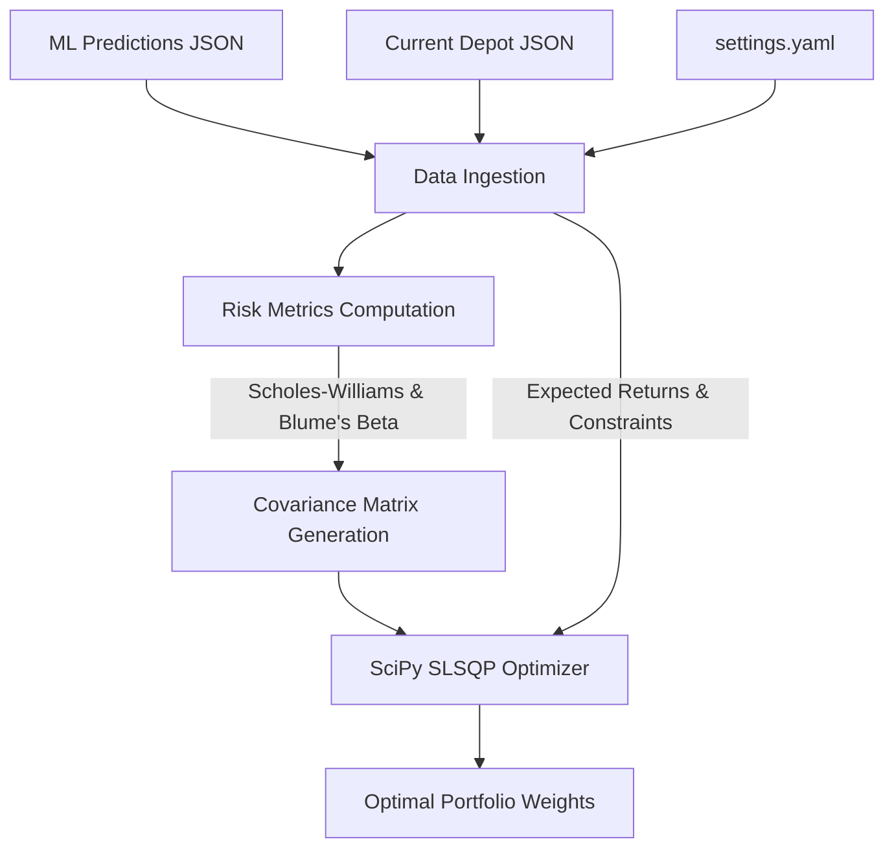

# Depot Hedging Strategist

This repository contains a portfolio hedging engine. It ingests predictions from an external ML model and a current depot state, calculates advanced risk metrics (specifically robust Beta), and executes a Markowitz Mean-Variance optimization to find a portfolio allocation that minimizes variance while guaranteeing an expected return (ROI) of at least 5%.

## Table of Contents

- [Folder Structure](#folder-structure)
- [Setup and Execution](#setup-and-execution)
- [Algorithm and Logic](#algorithm-and-logic)
  - [1. Data Ingestion](#1-data-ingestion)
  - [2. Risk Metrics (Robust Beta)](#2-risk-metrics-robust-beta)
  - [3. Portfolio Optimization](#3-portfolio-optimization)

## Folder Structure

- `src/`: Core logic of the application.
  - `ingestion.py`: Handles fetching remote JSON data and environment secrets.
  - `risk_metrics.py`: Contains custom functions for calculating advanced Beta.
  - `optimizer.py`: Contains the SciPy optimization logic.
- `config/`: Configuration and parameter files.
  - `settings.yaml`: Centralized configuration file for all user-defined parameters and thresholds.
- `tests/`: Unit and integration tests.
- `.github/workflows/`: GitHub Actions pipelines.
- `main.py`: Entry point for the pipeline.
- `requirements.in`: High-level dependencies.
- `requirements.txt`: Locked project dependencies (auto-generated via `pip-compile`).
- `.python-version`: Specifies the Python version for the project (e.g. 3.12).

## Setup and Execution

1. **Environment:** Execute local scripts using the Conda `base` environment to ensure consistency across local development setups. If you introduce new dependencies, add them to `requirements.in`, then run `pip-compile requirements.in -o requirements.txt` to generate the lockfile, and update your environment:
   ```bash
   conda install pip
   pip install pip-tools
   pip install -r requirements.txt
   ```

2. **Configuration:** All configurable parameters (e.g., target returns, hedging assets, market variance) are located in `config/settings.yaml`. Do not hardcode these in the Python files.

3. **Execution:** 
   For local execution, provide the current depot state as a JSON string via the `CURRENT_DEPOT_JSON` environment variable in a `.env` file at the root of the repository (you can copy `.env.example` to start):
   ```
   CURRENT_DEPOT_JSON='{"UN0.DE": 0.5, "ALV.DE": 0.5}'
   ```
   Then simply run:
   ```bash
   python main.py
   ```
   When executed via GitHub Actions, the `CURRENT_DEPOT_JSON` environment variable is securely injected from the repository's GitHub Secrets.

## Algorithm and Logic

The core logic of the hedging engine operates in three sequential phases: **Data Ingestion**, **Risk Metric Calculation**, and **Portfolio Optimization**.



### 1. Data Ingestion
The system begins by dynamically fetching data from external and internal sources:
- **ML Predictions:** Retrieves expected returns for various assets from an external machine learning model endpoint.
- **Current Portfolio:** Reads the user's current holdings from the environment (`CURRENT_DEPOT_JSON`).
- **Settings:** Loads configurable constraints (e.g., target returns, maximum asset weights, variances) centrally from `config/settings.yaml`.

### 2. Risk Metrics (Robust Beta)
Standard Beta calculations often fail to capture the asymmetric risk of assets and thin trading. This engine computes a **Robust Beta** using a specialized sequence of adjustments:

1. **Downside Filtering:** Only days where the benchmark yields a negative return are considered, isolating downside risk (Downside Beta).
2. **Scholes-Williams Adjustment:** Compensates for asynchronous and thin trading by summing the covariances of the stock with the benchmark at $t-1$, $t$, and $t+1$.
3. **Blume's Adjustment:** Applies mean-reversion to the Beta (using a $0.67$ weight on the calculated Beta and $0.33$ on a default Beta of $1.0$).

Once the adjusted Betas are computed, they are used to populate a **Single-Index Covariance Matrix**:
- Diagonal (Variance): $\beta_i^2 \times \sigma_{market}^2 + \sigma_{idiosyncratic}^2$
- Off-Diagonal (Covariance): $\beta_i \times \beta_j \times \sigma_{market}^2$

### 3. Portfolio Optimization
The final phase employs the **Markowitz Mean-Variance** framework using SciPy's `SLSQP` (Sequential Least Squares Programming) algorithm.

- **Objective Function:** Minimize the portfolio variance ($W^T \Sigma W$).
- **Constraints:**
  - The sum of all asset weights (including the `CASH` position) must equal exactly $1.0$ ($100\%$).
  - The expected portfolio return ($W^T R$) must be greater than or equal to the `min_portfolio_return` threshold (e.g., $5\%$).
- **Bounds:** Individual stock allocations are capped by `max_stock_weight` to enforce diversification, while hedging assets (like `CASH`) can float up to $1.0$.
